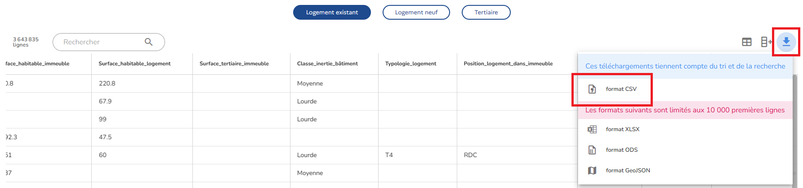

## Prérequis

L'entrepôt de données nécessite la présence sur le système :

* d'une installation de base de données *Oracle*,
* de *SQL\*loader* et
* de *Python* 3.10 ou plus récent.

## Installation

Le script SQL [`init.sql`](init.sql) peut être exécuté au sein d'une base de données pour y intégrer le schéma de l'entrepôt de données.

L'utilisateur appliquant le script doit avoir au moins les droits suivants :

* `CREATE PROCEDURE`
* `CREATE ROLE`
* `CREATE TABLE`
* `GRANT ANY ROLE`

## Remplissage

Les données peuvent être récupérées via la plateforme en ligne de l'[Observatoire DPE](https://observatoire-dpe.ademe.fr/donnees-dpe-publiques) :



Une fois téléchargé, le fichier `dpe-v2-logements-existants.csv` peut être placé dans le répertoire racine du dépôt, i.e. le même répertoire que ce document.

Les données peuvent être pré-traitées en exécutant le [script *Python*](parse.py) dans ce même répertoire via un terminal :

```
python ./parse.py
```
Une fois l'exécution de cette commande terminée, le répertoire `data` devrait contenir un fichier CSV par table, soit :

* [`data/communes.csv`](data/communes.csv)
* [`data/departements.csv`](data/departements.csv)
* [`data/dpes.csv`](data/dpes.csv)
* [`data/generateurs.csv`](data/generateurs.csv)
* [`data/installations_chauffage.csv`](data/installations_chauffage.csv)
* [`data/installations_ecs.csv`](data/installations_ecs.csv)
* [`data/installations_solaire.csv`](data/installations_solaire.csv)
* [`data/logements.csv`](data/logements.csv)

Les données peuvent être finalement chargées dans la base de données en utilisant *SQL\*loader* (en substituant `<???>` par l'accès à la base de données, par exemple `user/user@localhost:1521/XEPDB1` pour une installation locale avec un utilisateur `user` identifié de cette même manière) :

```
sqlldr <???> BAD=data/departements.bad CONTROL=data/departements.ctl LOG=data/departements.log skip=1
sqlldr <???> BAD=data/communes.bad CONTROL=data/communes.ctl LOG=data/communes.log skip=1
sqlldr <???> BAD=data/logements.bad CONTROL=data/logements.ctl LOG=data/logements.log skip=1
sqlldr <???> BAD=data/dpes.bad CONTROL=data/dpes.ctl LOG=data/dpes.log skip=1
sqlldr <???> BAD=data/installations_chauffage.bad CONTROL=data/installations_chauffage.ctl LOG=data/installations_chauffage.log skip=1
sqlldr <???> BAD=data/installations_ecs.bad CONTROL=data/installations_ecs.ctl LOG=data/installations_ecs.log skip=1
sqlldr <???> BAD=data/installations_solaire.bad CONTROL=data/installations_solaire.ctl LOG=data/installations_solaire.log skip=1
sqlldr <???> BAD=data/generateurs.bad CONTROL=data/generateurs.ctl LOG=data/generateurs.log skip=1
```

## Requêtes

Les requêtes sont disponibles dans le répertoire [`query/`](query/).

Des documents PDF des sorties sur *SQL developer* sont à disposition.